# AWS Security Lab

A hands-on AWS cloud security project focused on building, securing, monitoring, troubleshooting, and documenting a small production-style environment.

This lab was created to practice practical Security Engineering and Cloud Security skills, including network segmentation, IAM, Linux hardening, logging, incident investigation, and remediation.

---

## Project Goals

The main goals of this project are to:

- Build a custom AWS network from scratch
- Apply secure access controls
- Use IAM roles instead of long-term credentials
- Harden a Linux EC2 instance
- Enable cloud and network logging
- Investigate security events
- Practice incident response
- Document real troubleshooting and remediation work

---

## Architecture

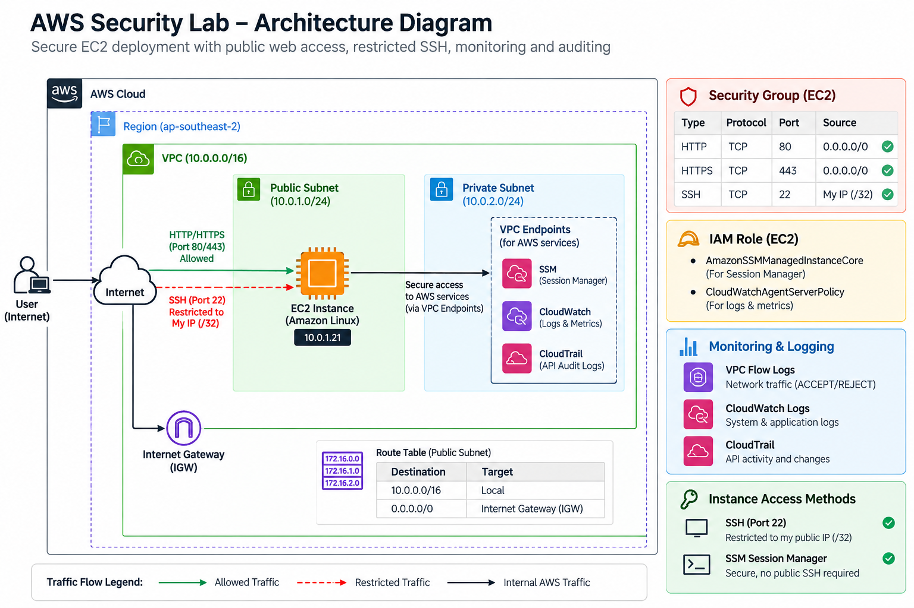

Current environment:

```text
Internet
   |
   v
Internet Gateway
   |
   v
security-lab-vpc
10.0.0.0/16
   |
   +-----------------------------+
   |                             |
   v                             v
Public Subnet                Private Subnet
10.0.1.0/24                 10.0.2.0/24
   |
   v
EC2 Web Server
Amazon Linux 2023
   |
   +-- Apache / HTTP :80
   +-- SSM Session Manager
   +-- IAM Role
   +-- firewalld
   +-- SSH hardening
```

The public subnet uses a route table with:

```text
0.0.0.0/0 -> Internet Gateway
```

The private subnet is reserved for later expansion.

---

## AWS Services Used

- Amazon VPC
- Amazon EC2
- AWS IAM
- AWS STS
- AWS CloudTrail
- Amazon CloudWatch
- VPC Flow Logs
- AWS Systems Manager Session Manager
- Amazon S3 permissions for IAM-role testing

---

## Evidence

### 01. VPC Overview
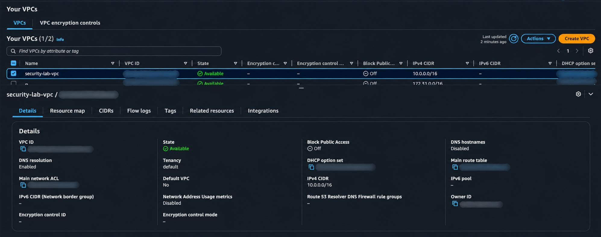

### 02. Public Subnet
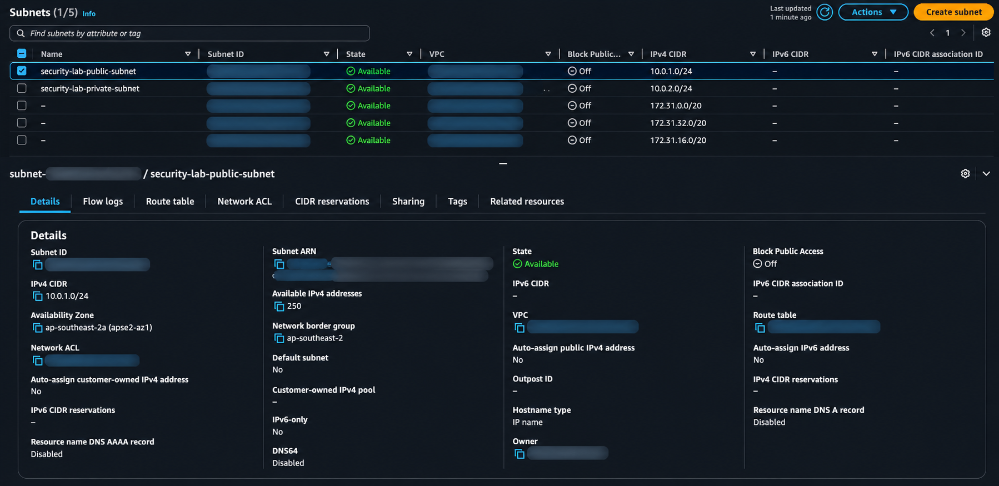

### 03. Private Subnet
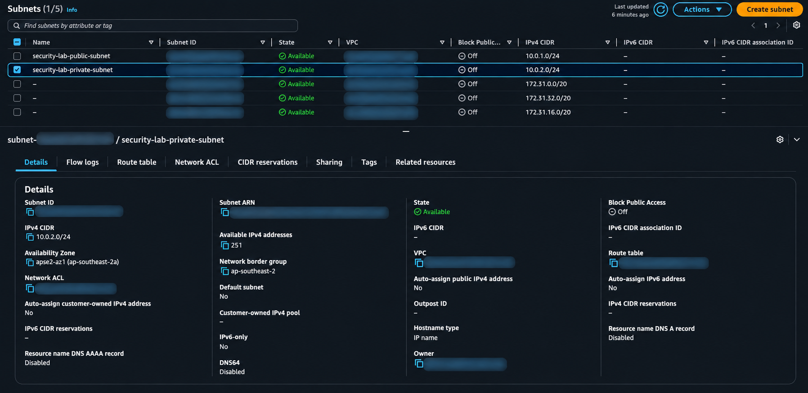

### 04. Public Route Table
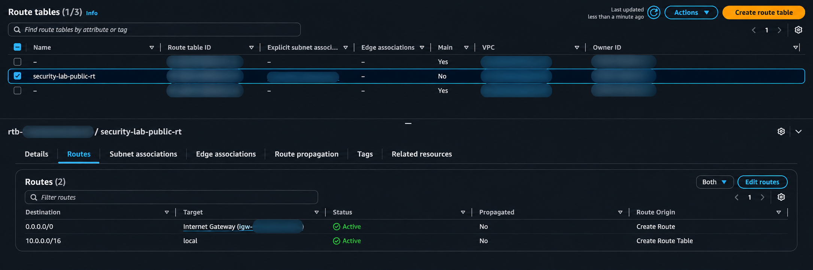

### 05. EC2 Instance
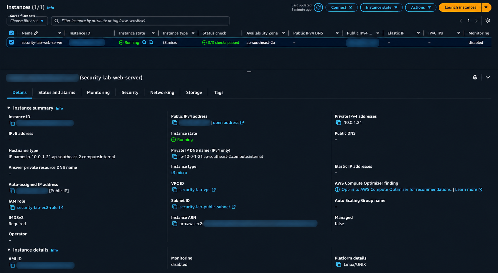

### 06. Security Group
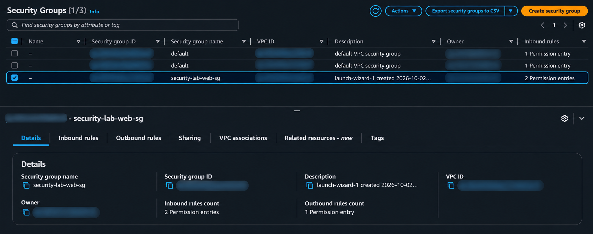

### 07. IAM Role
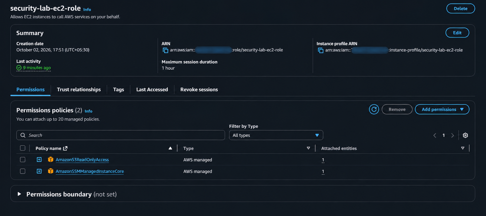

### 08. CloudTrail Group Rule Change
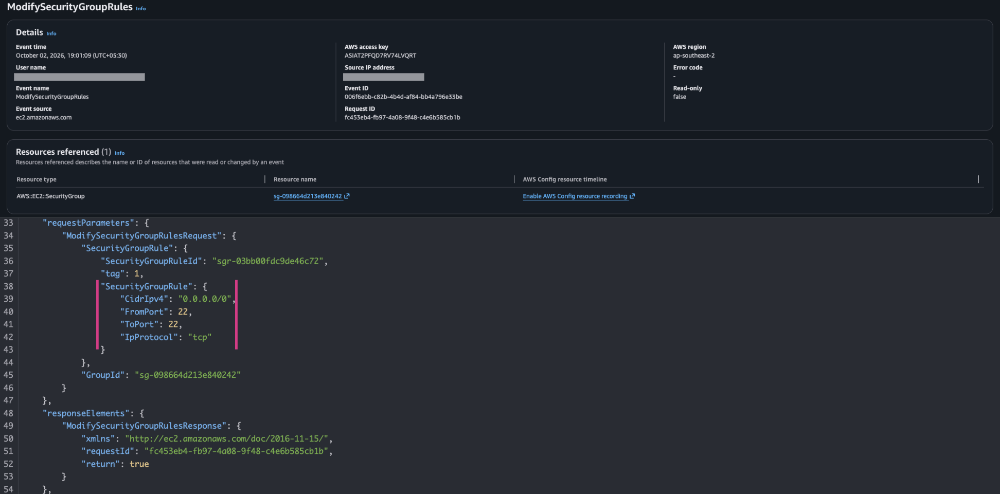

### 9. CloudWatch Logs Insights — Rejected SSH Traffic
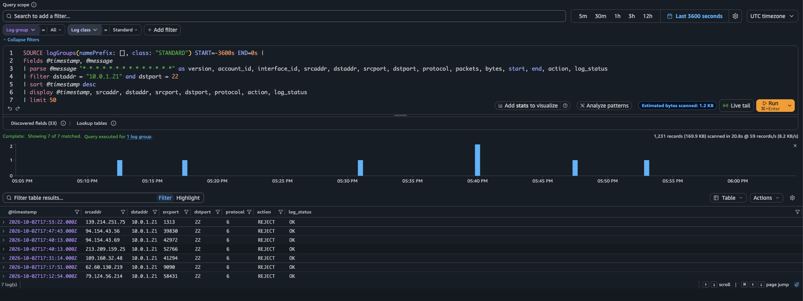

### 10. SSM Session Manager — SSH Status and Logs
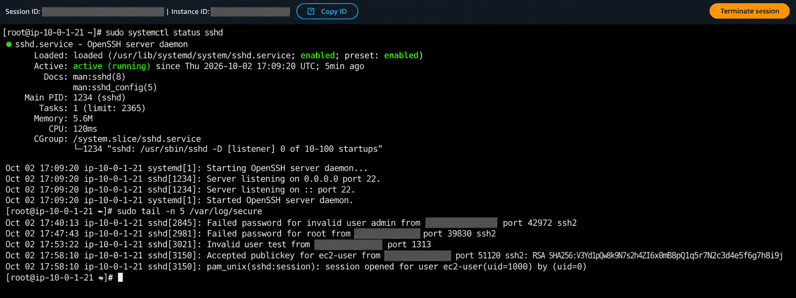

### 11. Successful SSH Access
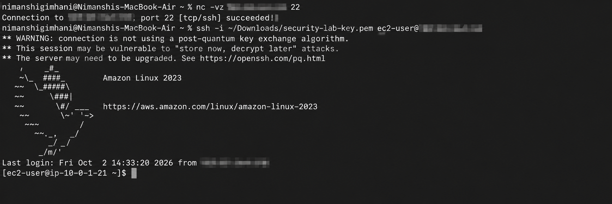

## Security Controls Implemented

### Network Security

- Custom VPC
- Separate public and private subnets
- Public route table
- Internet Gateway
- Security Group rules
- SSH restricted to a trusted `/32` source during testing
- Public HTTP on TCP port 80
- VPC Flow Logs enabled

### EC2 / Linux Hardening

- Amazon Linux 2023
- SSH key-based authentication
- Password authentication disabled
- Direct root SSH login disabled
- `firewalld` enabled
- Only required services allowed
- Apache web server configured

### IAM Security

- EC2 IAM role used instead of embedded AWS credentials
- Temporary credentials provided through AWS STS
- Least-privilege testing performed
- S3 read-only permission allowed
- Unauthorized IAM actions successfully denied
- AWS Systems Manager permissions added for Session Manager access

---

## Private Subnet Segmentation

The lab includes a private EC2 instance in `security-lab-private-subnet` with no public IPv4 address.

Administrative access is provided through AWS Systems Manager Session Manager using VPC interface endpoints.

The public web server is allowed to reach the private server on TCP port 22 through a security-group reference.

```text
Internet
   |
   v
Public EC2
10.0.1.21
   |
   | TCP 22 allowed
   v
Private EC2
10.0.2.70
No public IP
```

### Connectivity Test

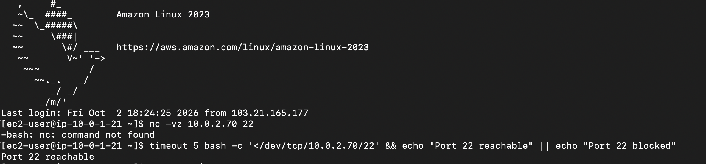

---

### Hardened Private Access

After validating public-to-private connectivity, SSH access to the private EC2 instance was removed.

The private server is now administered through AWS Systems Manager Session Manager using VPC interface endpoints, without exposing TCP port 22.

#### SSM Session Manager Connected

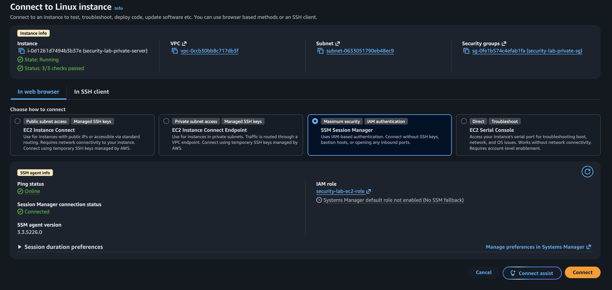

#### SSH Access Blocked

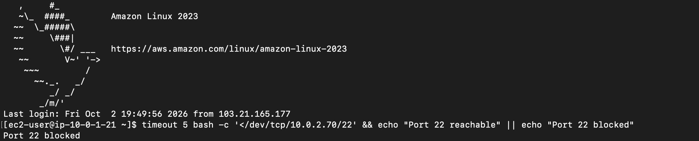

---

## IAM Least-Privilege Validation

The EC2 IAM role was refined by replacing the broad `AmazonS3ReadOnlyAccess` policy with a custom policy limited to the lab S3 bucket.

The instance can list and read objects from the designated bucket:

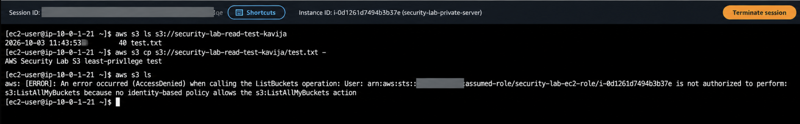

An account-wide S3 bucket listing was intentionally denied because the role does not include `s3:ListAllMyBuckets`.

This validates that the role follows the principle of least privilege.

---

## Logging and Monitoring

### AWS CloudTrail

CloudTrail was used to investigate account and resource changes such as:

- EC2 instance creation
- Security Group changes
- Route table creation
- Internet Gateway creation
- IAM role attachment
- VPC Flow Log creation

### VPC Flow Logs

VPC Flow Logs were sent to CloudWatch Logs to analyze:

- Source IP addresses
- Destination IP addresses
- Source ports
- Destination ports
- Protocols
- `ACCEPT` and `REJECT` actions

### CloudWatch Logs Insights

CloudWatch Logs Insights was used to isolate rejected SSH traffic.

Example query:

```sql
fields @timestamp, @message
| parse @message "* * * * * * * * * * * * * *" as version, account_id, interface_id, srcaddr, dstaddr, srcport, dstport, protocol, packets, bytes, start, end, action, log_status
| filter dstaddr = "10.0.1.21" and dstport = 22
| sort @timestamp desc
| display @timestamp, srcaddr, dstaddr, srcport, dstport, protocol, action, log_status
| limit 50
```

---

## Incident Reports

### Incident 001 — Overly Permissive SSH Security Group

A controlled misconfiguration was introduced by changing the SSH rule to:

```text
TCP 22
Source: 0.0.0.0/0
```

The EC2 instance was stopped before applying the rule so the vulnerable SSH service was not exposed.

The configuration change was:

1. Recorded by CloudTrail
2. Investigated using the raw event JSON
3. Confirmed as an internet-wide SSH exposure
4. Remediated by restricting SSH to a trusted `/32` source

See:

```text
incident-reports/incident-001-overly-permissive-ssh.md
```

---

### Incident 002 — SSH Connectivity and ISP Egress IP Troubleshooting

SSH connectivity failed even though:

- EC2 was healthy
- HTTP was reachable
- `sshd` was running
- Port 22 was listening
- `firewalld` allowed SSH
- The security group appeared correctly configured

VPC Flow Logs revealed that AWS was seeing a different source IP for the SSH traffic than the IP returned by a public IP lookup service.

The root cause was ISP/NAT/CGNAT-style egress behavior.

The actual source IP observed in VPC Flow Logs was added to the SSH security-group rule, and connectivity was restored.

See:

```text
incident-reports/incident-002-ssh-connectivity-and-cgnat-troubleshooting.md
```

---

## Key Security Lessons

### Least Privilege

Permissions should be limited to only what is required.

The EC2 IAM role was able to perform approved S3 read operations but was denied unrelated IAM operations.

### Defense in Depth

The EC2 instance used multiple security layers:

```text
AWS Security Group
        +
Linux firewalld
        +
SSH key authentication
        +
Root login disabled
        +
Password authentication disabled
```

### Auditability

CloudTrail made it possible to answer:

- Who made a change?
- What changed?
- When did it happen?
- From where?
- Which AWS resource was affected?

### Network Visibility

VPC Flow Logs helped determine whether traffic was:

```text
ACCEPT
```

or:

```text
REJECT
```

### Troubleshooting Method

The project followed a layered troubleshooting approach:

```text
Application
   ↓
Operating System
   ↓
Host Firewall
   ↓
Security Group
   ↓
VPC Network
   ↓
Flow Logs
   ↓
Client / ISP Path
```

---

## Current Security Improvement

The lab now supports AWS Systems Manager Session Manager.

The preferred administrative model is:

```text
Public Internet
   |
   +---- HTTP/HTTPS ---> EC2
   |
   X---- Public SSH

Administrator
   |
   v
AWS IAM
   |
   v
SSM Session Manager
   |
   v
EC2
```

This reduces dependence on changing public IP addresses and avoids exposing SSH directly to the internet.

---

## Repository Structure

```text
aws-security-lab/
├── README.md
├── architecture/
├── screenshots/
├── incident-reports/
│   ├── incident-001-overly-permissive-ssh.md
│   └── incident-002-ssh-connectivity-and-cgnat-troubleshooting.md
├── iam/
├── cloudtrail/
├── vpc-flow-logs/
└── notes/
```

---

## Planned Improvements

- Remove public SSH entirely and use SSM as the main admin path
- Add HTTPS
- Add encrypted EBS storage
- Build a private workload in the private subnet
- Add stronger IAM least-privilege policies
- Add CloudWatch alarms
- Add architecture diagrams
- Add infrastructure-as-code with Terraform
- Add more attack-detect-remediate exercises
- Extend the lab into a reusable cloud security portfolio project

---

## Skills Demonstrated

- AWS Cloud Security
- VPC Networking
- EC2 Administration
- IAM and STS
- Linux Hardening
- SSH Security
- Security Groups
- CloudTrail
- VPC Flow Logs
- CloudWatch Logs Insights
- AWS Systems Manager
- Incident Investigation
- Troubleshooting
- Least Privilege
- Defense in Depth
- Security Documentation

---

## Disclaimer

This project is a personal security lab created for educational and portfolio purposes.

All testing was performed only on resources owned and controlled by the project author.
